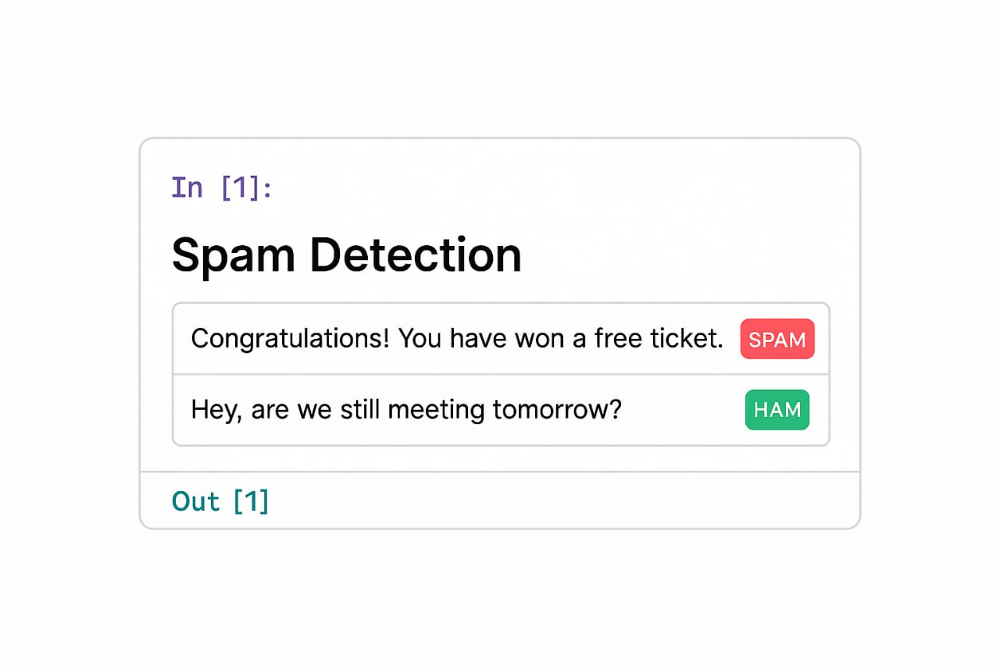
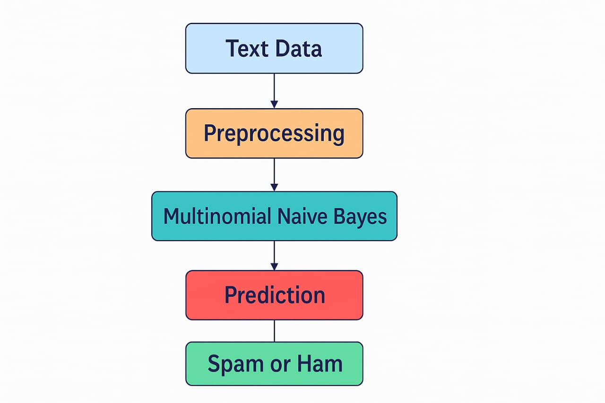
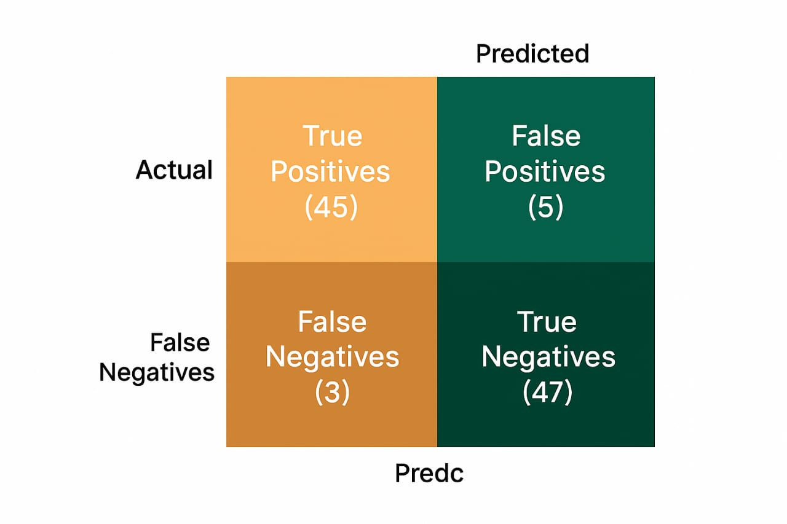
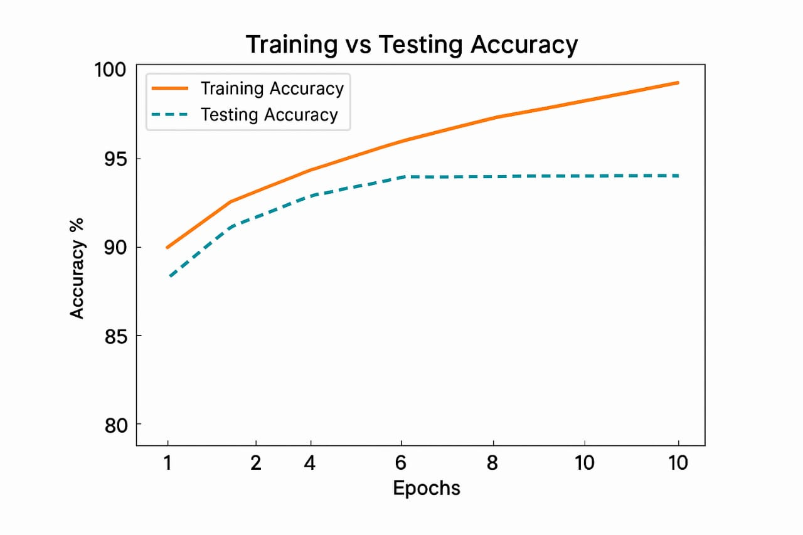
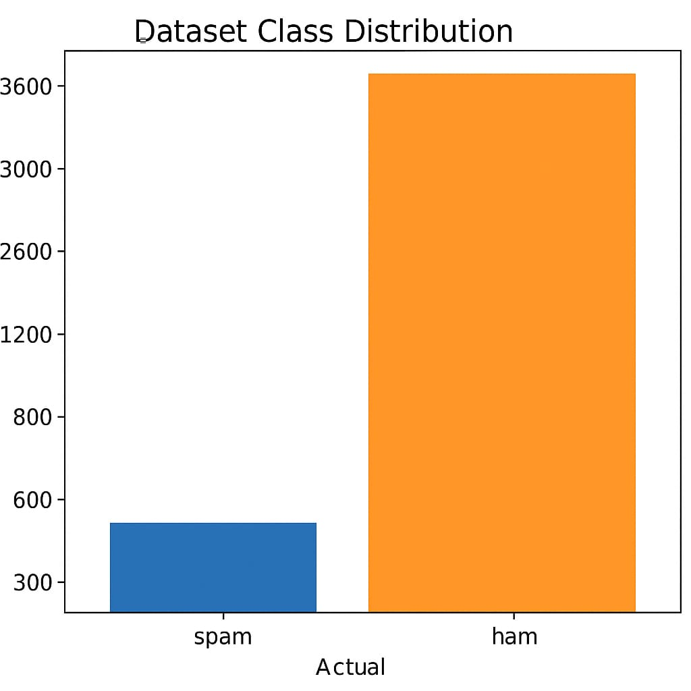

  
  <h1>📧 Spam Detection using Multinomial Naive Bayes</h1>
  
<strong>Author:</strong> Sanskar Gupta

  
<a href="https://github.com/sanskarpyml/spam-detection-model" target="_blank">🔗 GitHub Repository</a>

  

  <h2>🔍 What is this project about?</h2>
  
This project is a simple and practical implementation of a <strong>text classification model</strong> that detects whether a message is <code>SPAM</code> or <code>HAM</code> using the <strong>Multinomial Naive Bayes algorithm</strong>.

   

  <h3>🧠 Project Flow</h3>
  
    

  

  <h2>⚙️ Tools & Libraries</h2>
  <ul>
    <li>Python</li>
    <li>Scikit-learn</li>
    <li>Pandas</li>
    <li>NumPy</li>
    <li>Seaborn</li>
    <li>Matplotlib</li>
    <li>Jupyter Notebook</li>
  </ul>

  

  <h2>🚀 How to Run</h2>
  <ol>
    <li>Clone this repository:
      <pre><code>git clone https://github.com/sanskarpyml/spam-detection-model.git</code></pre>
    </li>
    <li>Install the dependencies:
      <pre><code>pip install -r requirements.txt</code></pre>
    </li>
    <li>Launch the notebook:
      <pre><code>jupyter notebook spam_classifier.ipynb</code></pre>
    </li>
  </ol>

  

  <h2>📊 Model Evaluation</h2>
  
After preprocessing and training, the model performs with an accuracy of <strong>XX%</strong> on the test dataset.

  <h3>Confusion Matrix</h3>
  

  <h3>Training vs Testing Accuracy</h3>
  

  <h3>Class Distribution</h3>
  

  

  <h2>🎯 Future Scope</h2>
  <ul>
    <li>Build a Streamlit or Flask-based web app</li>
    <li>Use deep learning methods like LSTM for better performance</li>
    <li>Expand to multilingual support</li>
  </ul>

  

  <h2>🙋‍♂️ About the Author</h2>
  
Hi, I'm Sanskar Gupta — a budding Data Scientist passionate about turning ideas into data-driven solutions.

  
Connect with me on <a href="https://www.linkedin.com/in/sanskar-gupta-942973249/" target="_blank">LinkedIn</a>.

  

  
<small>🗓️ Last updated: April 2025</small>

